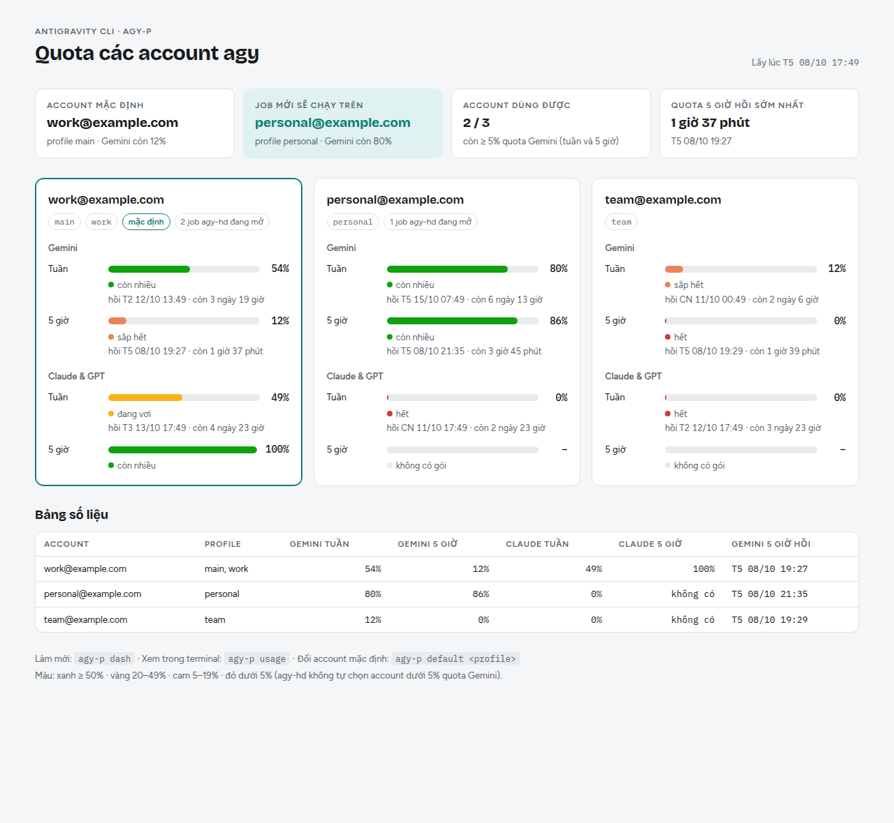
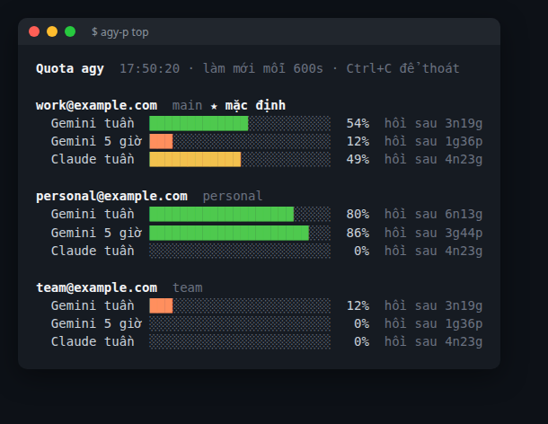

# claude-subagent-agy-herdr

A toolkit and agent skills suite enabling **Claude Code** to orchestrate **Antigravity CLI (`agy`)** as worker subagents, managed and visualized through the **`herdr`** terminal multiplexer.

---

## 💡 Operational Philosophy

> **Claude Code = Planner + Manager + Verifier**  
> **Antigravity (`agy`, Gemini 3.8 Flash High) = Fast, cost-effective Worker**

* **Claude Code** handles planning, task breakdown, progress tracking, result verification, and code merging.
* **`agy`** operates independently with high velocity, running with `--dangerously-skip-permissions` to swiftly execute well-scoped instructions.
* **1 Claude Code Session = 1 `herdr` Workspace** (e.g., `#132 Evaluate suggestion engine`).
* **1 Subagent = 1 Tab** inside that workspace (tab label matches job ID: `a-<task>-xxxx`).
* **Source Isolation**: The optional `-W` flag provisions an isolated Git worktree (branch `agy/<id>`), preventing uncommitted changes and conflicts on the main working tree.

---

## 📦 Suite Components

| Skill / Tool | Description | Primary Commands |
|---|---|---|
| **`agy-subagent`** | Delegate scoped tasks to an agy subagent; manage via herdr TUI or headless runner. | `agy-hd start`, `agy-sub`, `agy-ctl` |
| **`agy-parallel`** | Fan-out 2–4 independent tasks concurrently across isolated tabs and worktrees. | `agy-hd fan`, `agy-fan` |
| **`agy-review`** | Solicit an independent read-only second opinion on diffs/code, validated against a JSON schema (`schema.json`). | `agy-sub -R -s schema.json` |
| **`claude-task-id`** | Allocate and maintain a 3-digit task identifier (`#132 ...`) shared across Claude Code and herdr workspaces. | `agy-id claim`, `agy-id show` |
| **`agy-setup`** | Check, install and self-repair the suite on Linux / macOS / WSL / Windows (packages, herdr, agy, links, tick scheduler). | `agy-setup check`, `agy-setup fix -y`, `setup.ps1` |
| **`agy-accounts`** | Run agy on several Google accounts (one profile each): hidden login, per-account quota, default account, auto-pick and quota failover for jobs. | `agy-p add`, `agy-p usage`, `agy-p default`, `agy-hd start -u` |
| **`agy-login`** | Log an account in without the agy UI (this machine or a remote one over ssh), re-login, move accounts between machines. | `agy-p add`, `agy-p remote <host> add`, `agy-p relogin`, `agy-p export/import` |
| **`agy-quota`** | Quota left per account (Gemini/Claude, weekly and 5-hour): HTML dashboard, live terminal view, table. | `agy-p dash`, `agy-p top`, `agy-p usage`, `agy-p whoami` |
| **`agy-switch`** | Switch the account: default, current terminal, one running agy-hd job (same conversation), or auto by quota. | `agy-p switch [--auto]`, `agy-p use`, `agy-hd switch` |

Windows: headless runners also ship as PowerShell + CMD wrappers (`agy-sub`, `agy-ctl`, `agy-fan`, `agy-id` `.ps1`/`.cmd`); add the `scripts/` folders to `PATH`.

---

## ⏱️ Health Monitoring & Auto-Recovery (Scheduler)

Subagents can occasionally stall or hit API rate limits (such as Google Antigravity quota 429 / `RESOURCE_EXHAUSTED`). The suite employs a two-tier monitoring architecture:

1. **Systemd User Timer (`agy-hd-tick.timer`)**:
   * Executes `agy-hd tick` every minute independent of the active Claude Code session.
   * Maintains real-time status in `~/.cache/agy-hd/STATUS.tsv` and logs transitions to `events.log`.
   * **Automatic Quota Recovery**: Detects `RESOURCE_EXHAUSTED` (429), gracefully closes the hung process, and resumes the exact conversation via `agy-hd restart <job>` without losing context or restarting from scratch.
2. **Claude Code Cron Check-in**:
   * During async execution (`start -A` or `fan`), Claude Code schedules a 1-minute check-in to query `agy-hd tick --show` and react accordingly:
     * `RUNNING`: Actively working; continue monitoring.
     * `DONE`: Task completed; verify diffs and tests, then close tab (`agy-hd close` or `wt-merge`).
     * `QUOTA`: Automatically undergoing recovery by scheduler.
     * `STOPPED` / `STALL`: Process halted or hung; inspect logs, interrupt, or resume.
     * `BLOCKED`: Awaiting interactive human input.

---

## 👥 Multiple Accounts (`agy-accounts`, `agy-login`, `agy-quota`, `agy-switch`)

Each Google account is an **agy-p profile** (`~/.agy-profiles/<name>`; `main` is `~/.gemini`) with its own OAuth token.
Skills, plugins, MCP config and **conversations are shared**, so any conversation can be resumed under another account,
and agy-hd moves a job to another account when its quota runs out.

<picture>
  <source media="(prefers-color-scheme: dark)" srcset="docs/screenshots/dashboard-dark.png">
  
</picture>

<sub>`agy-p dash` (demo data). Live terminal view: `agy-p top`</sub>



### Log in (no agy UI needed)

```text
$ agy-p add                         # run it in the background from Claude Code, or in a terminal
Phiên đăng nhập: 9b61   (gửi mã: agy-p code 9b61 <mã>)
URL: https://accounts.google.com/o/oauth2/auth?...&prompt=select_account%20consent...
$ agy-p code 9b61 4/0AXlqoi...      # paste the code shown by antigravity.google/oauth-callback
Profile 'work' đã đăng nhập: work@example.com     # profile name comes from the email
```

On another machine over ssh (agy + agy-p installed there): `agy-p remote <host> add`, then
`agy-p remote <host> code <session> <code>`. Move an account that is already logged in: `agy-p remote <host> push|pull <profile>`,
or `agy-p export <profile> file.tgz` / `agy-p import file.tgz` (the file contains the login token: keep it private).

### Commands

| `agy-p …` | What it does |
|---|---|
| `add [name]`, `code <session> <code>` | Hidden login: prints the URL, takes the code; `add -i` opens the agy UI instead |
| `ls` · `whoami` | Profiles and emails (`*` = default) · account of this terminal, of plain `agy` here, and its quota |
| `usage [--tsv]` · `dash` · `top` | Quota table (scriptable TSV with cache) · HTML dashboard · live terminal bars |
| `default <p>` / `switch <p>` / `switch --auto` | Default account for new runs; `--auto` = account with the most Gemini quota |
| `use <p>` | This terminal only: `eval "$(agy-p use work)"` |
| `<p> [agy args]` · `best [agy args]` | Run agy on a profile · on the account with the most quota per open job |
| `rename <old> <new>` · `relogin <p>` · `rm <p>` | Rename (refused while agy runs on it) · log in again, old token restored on failure · remove |
| `export` / `import` / `remote <host> …` | Move accounts between machines; run any agy-p command over ssh (`AGY_SSH_OPTS="-p 2222"`) |
| `doctor` | Checks agy, the hidden `--gemini_dir` flag, shim, every profile, quota readability, agy-hd, timer, cas session |
| `completion zsh\|bash` | Tab completion: `source <(agy-p completion zsh)` |

| `agy-hd …` | Multi-account behaviour |
|---|---|
| `start` / `fan` `-u <p>` | Pin jobs to an account; without `-u` the account is auto-picked (`ACCOUNT=` line, `account` in ACCESS) |
| `switch <job> [p] [-f]` | Move a job to another account, same conversation (`-f` interrupts a running turn first) |
| `accounts` | Accounts, quota and the jobs (running / done) on each |
| `tick` (timer, every minute) | `QUOTA` → restart on another account with quota, resume the same conversation |

* **Auto-pick** (`agy-p pick`): the default profile while it has ≥ 20 % Gemini quota and < 2 open jobs, otherwise the account with the best `min(weekly, 5h) / (1 + open jobs)`; accounts under 5 % are skipped and profiles sharing an email count once.
* agy's built-in `invoke_subagent` and nested `agy` calls inside a job run on the job's account (a PATH shim pins `--gemini_dir`). agy-hd waits while the status bar shows `N subagent(s)`, so a job waiting on a subagent is not reported as done.
* Per-job lock: the tick and manual `park` / `resume` / `restart` / `switch` / `interrupt` / `close` never change the same job at the same time.
* How it works: agy stores the token in a file only when an SSH variable is set, otherwise in one gnome-keyring entry shared by every profile. agy-p always sets `SSH_CONNECTION` and passes agy's hidden `--gemini_dir` flag. Re-check after `agy update` with `agy-p doctor`.
* Switch the default with `agy-p switch`, not `/logout` + `/login` in `~/.gemini`: another running session refreshes its token and writes the old account back.

### Tests (2026-10-08/09, real accounts, herdr session `cas`)

| Suite | Result |
|---|---|
| `selftest.sh` (agy-sub / agy-ctl / agy-fan) from a fresh clone of this repo | 29 / 29 PASS |
| `agy-accounts/tests/concurrency.sh`: 4 parallel `start`, job lock (`park` waits, `switch` + `park` serialize), 4 simultaneous `resume` while `tick` runs | 7 / 7 PASS (again after the final review fixes) |
| `agy-accounts/tests/e2e-accounts.sh`: `-u`, auto-pick, `fan` spread, subagent wait, quota failover with the same conversation, `switch`, immediate park/resume, nested agy, `agy-sub -u`, `accounts` | 10 / 10 PASS; after the final review fixes 9 / 10, the one failure was the test's own D7 check (fixed) |
| Cross-account `switch`, `fan` split over two accounts, quota failover to another account | PASS (2026-10-09, after the review fixes) |
| Final review fix checks: 14 `agy-p` / `login.py` cases, 7 `agy-hd` / `agy-sub` cases | all PASS |

---

## 🚀 Installation

Supported: **Linux** (Ubuntu/Debian, Fedora/RHEL, Arch, openSUSE, Alpine), **macOS** (Intel, Apple silicon), **WSL**, and
**Windows** (PowerShell; `agy-hd`/`agy-p` run inside WSL, the headless runners `agy-sub`/`agy-ctl`/`agy-fan`/`agy-id` run natively).

### 1. Clone repository
```bash
git clone git@github.com:sowndev0106/claude-subagent-agy-herdr.git
cd claude-subagent-agy-herdr
```

### 2. Run the setup (check, install, self-repair)

**Linux / macOS / WSL** (works with plain `sh` too, even where bash is missing):
```bash
./agy-setup/scripts/setup.sh check     # report only
./agy-setup/scripts/setup.sh fix -y    # install what is missing   (./install.sh does the same)
```
`fix` installs system packages with your package manager (apt / dnf / yum / pacman / zypper / apk / Homebrew; bash ≥ 4.4, git,
jq, python3, perl, curl, procps...), **herdr** and **agy** with their official installers, links the skills into
`~/.claude/skills` and the commands into `~/.local/bin` (including `agy-setup`), schedules `agy-hd tick` every minute
(systemd user timer on Linux, launchd on macOS, cron otherwise) and puts `~/.local/bin` on your `PATH`.
System packages are installed only as root or with passwordless sudo; otherwise the exact command is printed.

**Windows**:
```powershell
powershell -ExecutionPolicy Bypass -File agy-setup\scripts\setup.ps1 fix -Yes
```
Installs agy and herdr (official installers), git / jq / python (winget), links the skills (junctions) and puts the script
folders on the user `PATH`. With WSL present it also runs `setup.sh fix -y` inside WSL for the full suite.

### Self-repair

* Every script loads `agy-subagent/scripts/compat.sh`: on bash < 4.4 it re-runs itself with a newer bash (Homebrew), and GNU-only
  tools are replaced by portable functions (`/proc`, `stat -c`, `sed -i`, `date -d`, `ps etimes`, `readlink -f`...) or emulated
  when missing (`flock`, `timeout`, `setsid`, `tac`, `md5sum`, `sha256sum`, `column`).
* A missing dependency (jq, herdr, agy...) triggers `setup.sh fix -y` automatically, at most once per hour
  (log: `~/.cache/agy-setup/repair.log`; disable with `AGY_AUTO_REPAIR=0`).
* `agy-p doctor --fix` repairs accounts: token permissions, profile symlinks, onboarding flags, abandoned logins, broken default.
* The `agy-setup` skill tells Claude to run `agy-setup check` / `fix -y` and retry whenever an agy command fails with an
  environment error, and to patch `compat.sh` (with tests) for a new OS.
* Tests: `agy-setup/tests/compat-test.sh` (run it also with `AGY_COMPAT_FORCE=1` to exercise the macOS/busybox paths),
  `agy-setup/tests/distro-test.sh` (Debian, Fedora, Alpine, Arch in Docker), `pwsh -File agy-setup/tests/ps-parse.ps1`.

### 3. Grant permissions in Claude Code
Add the required bash tool executions to `permissions.allow` in `~/.claude/settings.json`:

```json
{
  "permissions": {
    "allow": [
      "Bash(agy-hd:*)",
      "Bash(agy-sub:*)",
      "Bash(agy-fan:*)",
      "Bash(agy-ctl:*)",
      "Bash(agy-id:*)",
      "Bash(agy-p:*)"
    ]
  }
}
```

---

## 🛠️ Quick Start

### 1. Claim a Task ID for your session
```bash
agy-id claim "Refactor parser module"
# Returns: #133 Refactor parser module
```

### 2. Launch an agy subagent in herdr (with isolated worktree)
```bash
# Launch task in dedicated worktree asynchronously
agy-hd start -n parser -d /path/to/repo -W -f task.md -A

# Inspect live in herdr TUI
herdr --session cas

# Or directly attach to the agent's tab
agy-hd open <job-id>

# Review diff once done
agy-hd wt-diff <job-id>

# Merge changes into current branch and close tab
agy-hd wt-merge <job-id>
```

### 3. Run parallel tasks (`fan-out`)
```bash
# Prepare tasks directory containing individual <task_id>.md files
agy-hd fan -i ./tasks -o ./results -j 3 -d /path/to/repo -W
```

### 4. Independent Code Review with JSON Schema
```bash
git diff main...HEAD > /tmp/diff.patch
agy-sub -R -d /path/to/repo -s "$(cat ~/.claude/skills/agy-review/schema.json)" \
  -p "Review diff at /tmp/diff.patch. Detect logic bugs, race conditions, missing tests."
```

---

## 📂 Repository Structure

```
claude-subagent-agy-herdr/
├── README.md                  # Documentation and architecture guide
├── install.sh                 # Wrapper: agy-setup/scripts/setup.sh fix
├── .gitignore
├── agy-subagent/              # Core subagent skill
│   ├── SKILL.md
│   ├── REFERENCE.md
│   ├── scripts/
│   │   ├── compat.sh          # Portability layer (macOS/BSD/busybox) + auto-repair
│   │   ├── agy-hd.sh          # Primary runner via herdr multiplexer (TUI)
│   │   ├── agy-sub.sh         # Headless single-job runner
│   │   ├── agy-fan.sh         # Headless parallel runner
│   │   ├── agy-ctl.sh         # Job lifecycle CLI controller
│   │   ├── *.ps1 / *.cmd      # Windows runners (agy-sub, agy-ctl, agy-fan)
│   │   ├── selftest.sh        # Headless automated test suite
│   │   └── selftest-hd.sh     # Herdr integration automated test suite
│   └── systemd/
│       ├── agy-hd-tick.service
│       └── agy-hd-tick.timer  # 1-minute watchdog timer & quota auto-restart
├── agy-parallel/              # Multi-agent fan-out orchestration skill
│   └── SKILL.md
├── agy-review/                # Second-opinion code review skill
│   ├── SKILL.md
│   └── schema.json            # JSON schema validating review findings
├── claude-task-id/            # Session ID & workspace naming skill
│   ├── SKILL.md
│   └── scripts/
│       └── agy-id.sh          # Maps session IDs to #100..#999 task identifiers
├── agy-login/                 # Skill: log in (local / remote), re-login, move accounts
├── agy-quota/                 # Skill: quota dashboard and views
├── agy-switch/                # Skill: switch default / terminal / job account
├── agy-setup/                 # Setup + self-repair: setup.sh (Linux/macOS/WSL), setup.ps1 (Windows), tests
└── agy-accounts/              # Multiple Google accounts for agy (agy-p and its docs)
    ├── SKILL.md
    └── scripts/
        ├── agy-p.sh           # Profiles: add/ls/usage/default/pick/env/rm, run agy on a profile
        ├── login.py           # Hidden login: drives the agy TUI in a pty, prints the OAuth URL
        ├── dashboard.html     # Template for agy-p dash
        └── shim/agy           # Keeps nested agy calls on the same profile
```
